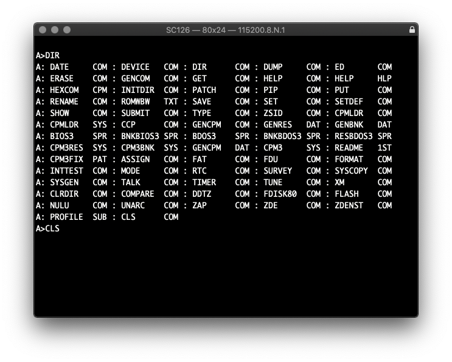
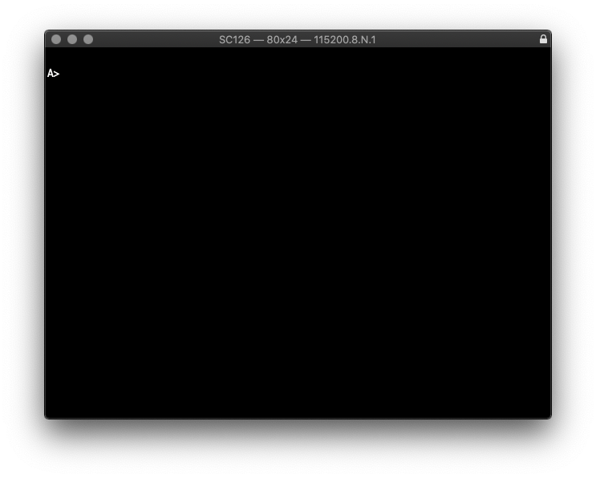

# CLS for CP/M
There is no built-in utility to clear the screen, so as a first project, I created `CLS` for CP/M. So, if you're tired of looking at messy screens full of clutter, look no farther! This will finely crafted application will not only clear your screen, it will do so with precision, and without delay!

<figure>
  
  <figcaption>Before CLS</figcaption>
</figure>
<figure>
  
  <figcaption>After CLS</figcaption>
</figure>

### Note
This has only been tested on an SC126 Z180 based retro computer, running CP/M 3. 

Made to be built with Z88DK. Change the options in the Makefile to reflect the machine you're compiling for.
